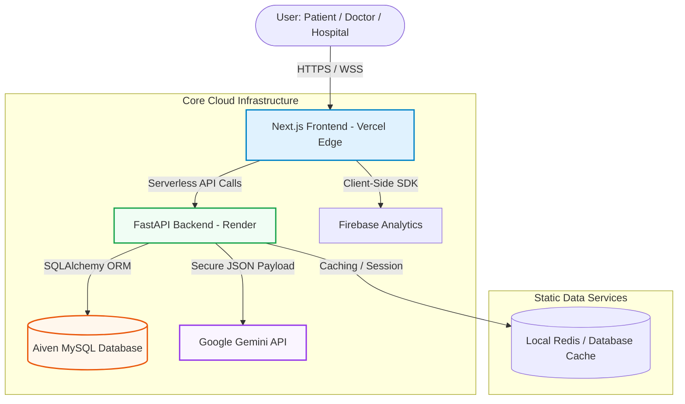
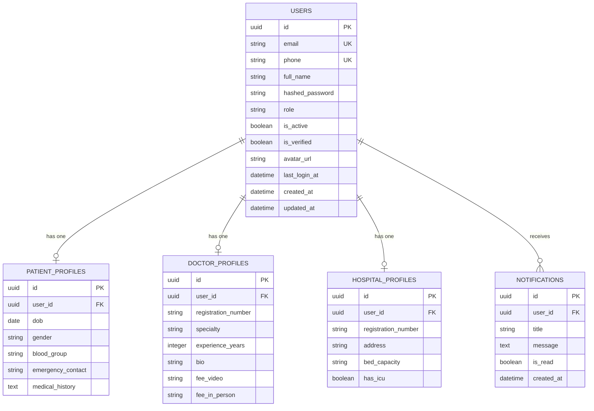
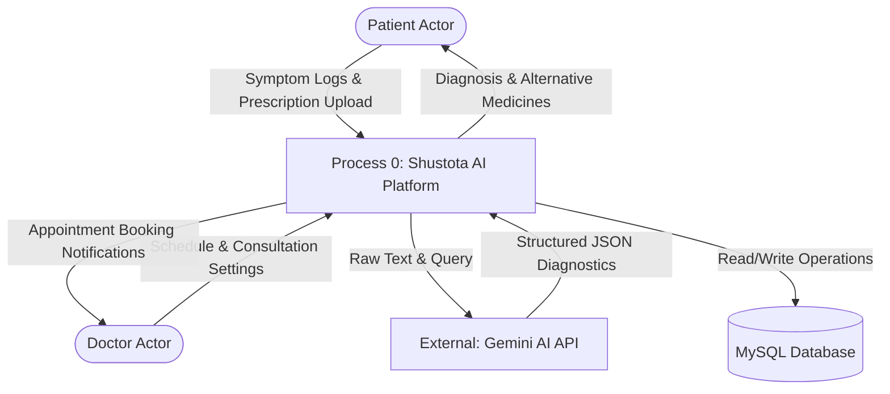
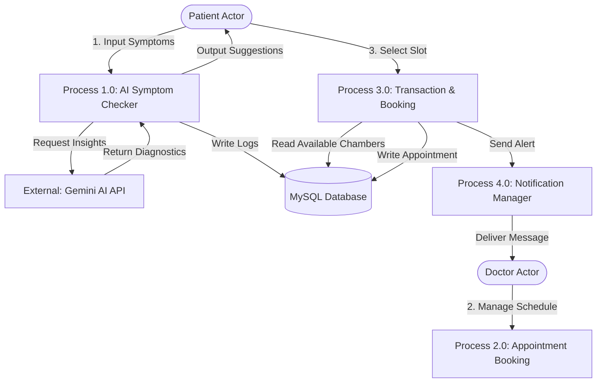
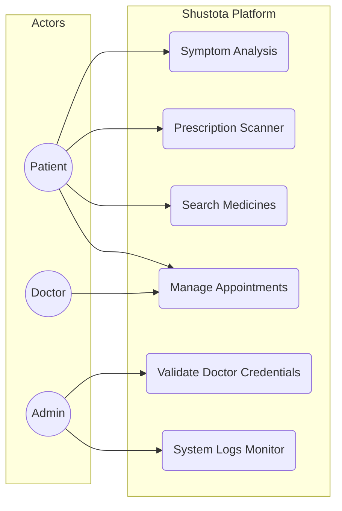
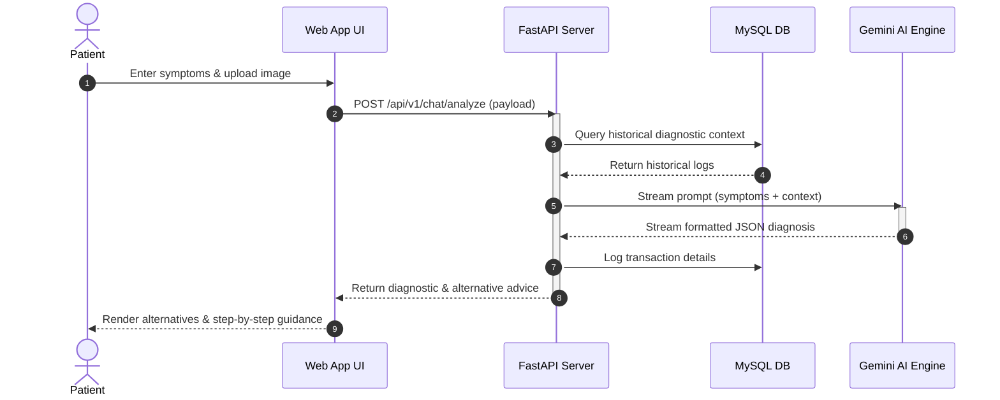

# Shustota AI: Decentralized Clinical Intelligence Platform

An enterprise-grade, zero-overhead AI healthcare ecosystem designed for low-bandwidth, high-volume patient-doctor-hospital management. Engineered for instant clinical symptom analysis, prescription OCR scanning, and intelligent medical directory mapping. 

Fully optimized to run at zero operating cost on free tier cloud infrastructures.

---

## The Problem

Healthcare delivery in developing countries suffers from structural bottlenecks:
1. **Clinical Inaccessibility:** Overburdened healthcare systems result in delayed primary checkups and self-medication.
2. **Prescription Illiteracy:** Hand-written prescriptions lead to critical dosing errors due to illegible writing and poor patient comprehension.
3. **Exploitative Pricing:** Lack of transparent alternative options leads to artificial inflation of medical expenses for the underprivileged.
4. **Infrastructure Costs:** Deploying clinical grade software typically requires expensive cloud resources, making free-of-cost service distribution unsustainable.

---

## The Solution

Shustota AI resolves these challenges through a unified, hyper-efficient clinical stack:
* **Medical-Grade AI Diagnostics:** Real-time symptom checks utilizing secure Gemini API configurations, optimized with bilingual (English and Bengali) prompting rules.
* **Psychology-Driven Engagement:** Incorporates the **Labor Illusion** effect during scanning, the **Goal Gradient** effect for registration, and the **Zeigarnik Effect** to drive profile completion.
* **Dynamic Generic Mapping:** Instantly parses prescriptions using AI-powered OCR, detects the active ingredients, and presents cost-effective alternative medicines sorted by price.
* **Serverless Cost-Efficiency:** Designed to leverage Vercel Serverless Edge, Aiven MySQL database pools, and Render automated sleep-management, running the entire app completely for free.

---

## Live Demo & Tech Stack

* **Live Frontend:** [shushthota.vercel.app](https://shushthota.vercel.app) (Deployed on Vercel)
* **Live Backend API:** [shustota-backend.onrender.com](https://shustota-backend.onrender.com) (FastAPI on Render)

### The Architecture Stack
* **Frontend:** Next.js (App Router), React 19, Tailwind CSS, Framer Motion, Lucide Icons, Sonner.
* **Backend:** FastAPI, Python 3.11, Pydantic v2, SQLAlchemy (ORM), Alembic (Migrations).
* **Database:** MySQL (Aiven Cloud Instance).
* **AI Engine:** Google Gemini Pro API.

---

## Local Setup & Run Instructions

Ensure Node.js v22+ and Python 3.11+ are installed locally.

### 1. Backend Setup
```bash
# Navigate to backend directory
cd Backend

# Create and activate virtual environment
python -m venv .venv
source .venv/bin/activate  # On Windows: .venv\Scripts\activate

# Install dependencies
pip install -r requirements.txt

# Run database setup and seed mock data
python setup_db.py

# Start local FastAPI server
uvicorn main:app --reload --port 8000
```

### 2. Frontend Setup
```bash
# Navigate to project root
cd ..

# Install dependencies
npm install

# Run build to verify types and assets
npm run build

# Start local development server
npm run dev
```

---

## System Documentation

### 1. System Architecture Diagram



### 2. Entity-Relationship Diagram (ERD)



### 3. Data Flow Diagram (DFD Level 0 and Level 1)

#### Level 0: Context Diagram



#### Level 1: Process Diagram



### 4. Use Case Diagram



### 5. Sequence Diagram: Clinical Diagnostic Loop


